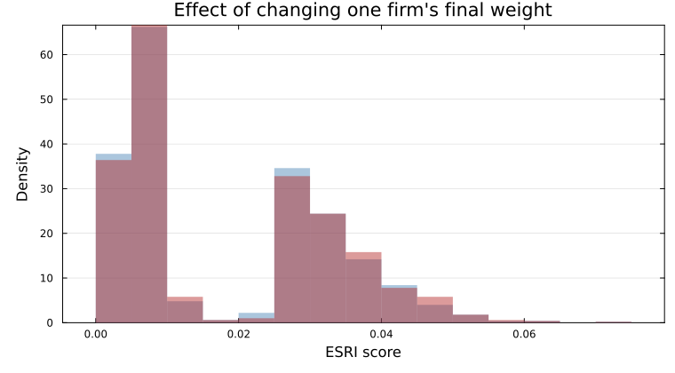
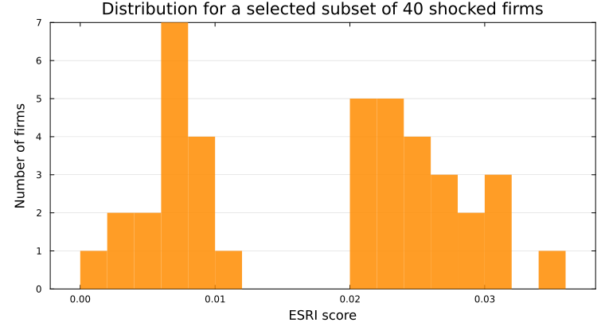

# Examples

## Economy-wide run

```@doctest
using ESRI, SparseArrays, Random, Statistics
Random.seed!(42)

N = 1_000
W = sprand(N, N, 0.01)
W[1:N+1:end] .= 0
info = IndustryInfo(rand(1:3, N), [true, false, true])
econ = ESRIEconomy(W, info)

scores = esri(econ; maxiter = 30, tol = 1e-3, threads = false)
nothing
```


## Single firm with full details

```@doctest
res = esri(econ, 5; details = true, maxiter = 20, tol = 1e-3)
(res.esri, length(res.upstream), length(res.downstream))
# output
(0.3400687234719314, 1000, 1000)
```

This call is useful when you want the full scenario, not just one number. `res.upstream` and `res.downstream` show which firms lose production because inputs fail, which firms lose production because customers fail, and where the stress is strongest.

## Requested components only

```@doctest
up_only = esri(econ, 3; components = :upstream, maxiter = 25, tol = 1e-3)
down_only = esri(econ, 3; components = :downstream, maxiter = 25, tol = 1e-3)
```

## Custom final weights

```@doctest
output_weights = vec(sum(W; dims = 2))
scores_output = esri(econ; final_weights = output_weights, maxiter = 25, tol = 1e-3)

spike_weights = copy(output_weights)
spike_weights[10] = 100.0
scores_spike = esri(econ; final_weights = spike_weights, maxiter = 25, tol = 1e-3)

(scores_output ≈ scores, round(mean(scores_spike) - mean(scores_output); digits = 4))
# output
(true, 0.0009)
```



Here `output_weights` are each firm's own baseline outputs, computed directly from the same `W`. That reproduces the default score distribution. After setting one firm's weight to `100`, the distribution changes, but it stays similar because only the final aggregation weights changed. The network dynamics and shock propagation are the same.

## Subset of default firm shocks

```@doctest
subset_indices = collect(25:25:1_000)
subset_scores = esri(econ; firm_indices = subset_indices, maxiter = 20, tol = 1e-3, threads = false)
count(!iszero, subset_scores), round.(extrema(subset_scores[subset_scores .> 0]); digits = 3)
# output
(40, (0.006, 0.059))
```



## Custom shock vector

```@doctest
psi = ones(N)
psi[1] = 0.0
psi[2] = 0.0
psi[3] = 0.5
psi[4] = 0.5
psi[5] = 0.8

# Here psi[i] is firm i's exogenous capacity cap:
# 1.0 = normal operation, 0.0 = shut down, values in between = partial capacity.
# This is how you encode real-world shocks such as plant closures, transport bottlenecks,
# sanctions, or energy shortages before asking how they spread through the whole economy.
scenario = esri_shock(econ, psi; details = true, maxiter = 25, tol = 1e-3)
(scenario.esri, round.(scenario.upstream[1:3]; digits = 3), round.(scenario.downstream[1:3]; digits = 3))
# output
(0.31872022292698855, [0.0, 0.0, 0.5], [0.0, 0.0, 0.5])
```

## Single-firm call with explicit shock

```@doctest
psi2 = ones(N)
psi2[1:3] .= 0.4

res1 = esri(econ, 7; shock = psi2, details = true, maxiter = 25, tol = 1e-3)
res2 = esri_shock(econ, psi2; details = true, maxiter = 25, tol = 1e-3)
res1.esri ≈ res2.esri
# output
true
```

## Matrix-first wrappers

```@doctest
value = compute_esri(W, info, 7; maxiter = 20, tol = 1e-3)
```
