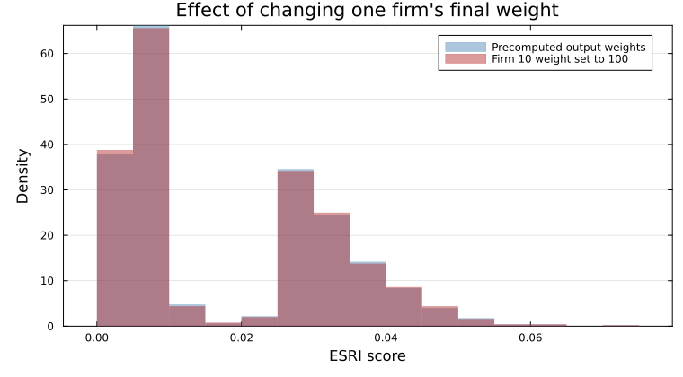
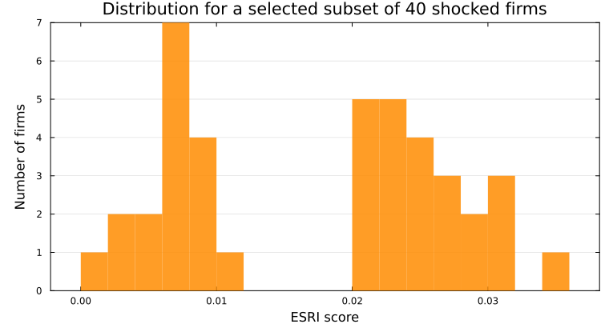

# Examples

## Economy-wide run

```@doctest
using ESRIcascade, SparseArrays, Statistics, Random
Random.seed!(42)

N = 1_000
W = sprand(N, N, 0.01)
W[1:N+1:end] .= 0
info = IndustryInfo(rand(1:4, N), [true, true, false, false])
econ = ESRIEconomy(W, info)

scores = esri(econ; maxiter = 40, tol = 1e-3, threads = false)
nothing
```

`IndustryInfo(industry_of_firm)` uses a purely linear production function by
default. Pass an essentiality vector or an integer-code matrix such as
`Matrix{UInt8}` when the production function should include essential inputs.

`W[i, j]` is the nonnegative supply from supplier `i` to customer `j`.


## Bundled IHS classification

Use one NACE Rev. 2 four-digit code per firm. Keep the codes as strings to
preserve leading zeros.

```@doctest
ihs_W = [0.0 2.0; 1.0 0.0]
firm_industry_codes = ["0111", "0112"]
codes = ihs_industry_codes()
industry_id = Dict(code => i for (i, code) in pairs(codes))
industry_of_firm = [industry_id[code] for code in firm_industry_codes]
ihs_info = IndustryInfo(industry_of_firm, ihs_input_classification())
ihs_econ = ESRIEconomy(ihs_W, ihs_info)
ihs_scores = esri(ihs_econ)
nothing
```

## Customer-specific input classes

Rows are supplier industries and columns are customer industries. Use a
`Matrix{UInt8}` with codes `0`, `1`, and `2`.

```@doctest
custom_W = [0.0 2.0 1.0; 1.0 0.0 3.0; 4.0 1.0 0.0]
input_classification = UInt8[2 1 0; 0 2 1; 1 0 2]
custom_info = IndustryInfo([1, 2, 3], input_classification)
custom_econ = ESRIEconomy(custom_W, custom_info)
custom_scores = esri(custom_econ; maxiter = 40, tol = 1e-3)
nothing
```

Code `0` keeps an input in the network and upstream propagation and contributes
to the linear-input denominator. Codes `1` and `2` select the linear and
essential downstream operators and add their direct entries.

## Single firm with full details

```@doctest
res = esri(econ, 5; details = true, maxiter = 20, tol = 1e-3)
(res.esri, length(res.upstream), length(res.downstream))
# output
(0.3400687234719314, 1000, 1000)
```

This call returns the complete scenario state. `res.upstream` stores the
remaining production after customer losses. `res.downstream` stores the
remaining production after input shortages. Values near zero identify the
strongest stress locations.

## Selected components

```@doctest
up_only = esri(econ, 3; components = :upstream, maxiter = 25, tol = 1e-3)
down_only = esri(econ, 3; components = :downstream, maxiter = 25, tol = 1e-3)
```

## Custom final weights

```@doctest
output_weights = vec(sum(W; dims = 2))
scores_output = esri(econ; final_weights = output_weights, maxiter = 25, tol = 1e-3)

spike_weights = copy(output_weights)
spike_weights[10] = 100.0
scores_spike = esri(econ; final_weights = spike_weights, maxiter = 25, tol = 1e-3)

(scores_output ≈ scores, round(mean(scores_spike) - mean(scores_output); digits = 4))
# output
(true, 0.0009)
```



Here `output_weights` are each firm's baseline outputs, computed directly from
the same `W`. They reproduce the default score distribution. Setting one
firm's weight to `100` changes the distribution while preserving the network
dynamics and shock propagation.

The default score uses total output as its denominator. Custom
`final_weights` use `sum(final_weights)` and produce a weighted average loss. A
zero total weight returns `0`.

## Subset of default firm shocks

```@doctest
subset_indices = collect(25:25:1_000)
subset_scores = esri(econ; firm_indices = subset_indices, maxiter = 20, tol = 1e-3, threads = false)
count(!iszero, subset_scores), round.(extrema(subset_scores[subset_scores .> 0]); digits = 3)
# output
(40, (0.006, 0.059))
```



## Custom shock vector

```@doctest
psi = ones(N)
psi[1] = 0.0
psi[2] = 0.0
psi[3] = 0.5
psi[4] = 0.5
psi[5] = 0.8

# psi[i] is firm i's exogenous capacity limit.
# 1.0 makes full capacity available. 0.0 closes the firm.
# Values between these limits make partial capacity available.
scenario = esri_shock(econ, psi; details = true, maxiter = 25, tol = 1e-3)
(
    scenario.esri,
    round.(scenario.upstream[1:3]; digits = 3),
    round.(scenario.downstream[1:3]; digits = 3),
)
# output
(0.31872022292698855, [0.0, 0.0, 0.5], [0.0, 0.0, 0.5])
```

## Single-firm call with explicit shock

```@doctest
psi2 = ones(N)
psi2[1:3] .= 0.4

res1 = esri(econ, 7; shock = psi2, details = true, maxiter = 25, tol = 1e-3)
res2 = esri_shock(econ, psi2; details = true, maxiter = 25, tol = 1e-3)
res1.esri ≈ res2.esri
# output
true
```

## Matrix-first wrappers

```@doctest
value = compute_esri(W, info, 7; maxiter = 20, tol = 1e-3)
```

For the submitted runtime comparison and benchmark conditions, see
[Performance](performance.md).
