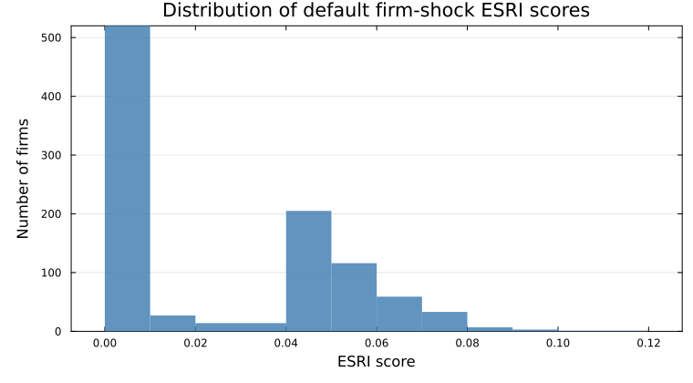

# ESRIcascade.jl

`ESRIcascade.jl` computes firm-level economic systemic risk indicators from an input-output network.

## Installation

```julia
using Pkg
Pkg.add(url = "https://github.com/Devetak/ESRIcascade.jl")
```

## Quick start

```@doctest
using ESRIcascade, SparseArrays, LinearAlgebra

N = 1_000
W = sprand(N, N, 0.01)
W[1:N+1:end] .= 0
info = IndustryInfo(rand(1:4, N), [true, true, false, false]) # industry 1 and 2 are essential

econ = ESRIEconomy(W, info) # set up the economy
scores = esri(econ; maxiter = 40, tol = 1e-3) # compute ESRI for each firm
nothing
```



The histogram is usually the first thing to look at. If most firms sit near zero, most single-firm failures have limited economy-wide spillovers. A longer right tail means some firms create much larger losses when they fail.

Build `ESRIEconomy` once and reuse it on the same network.
