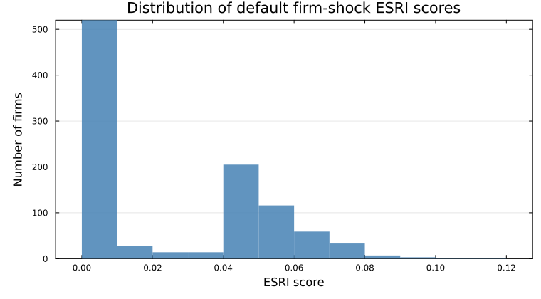

# ESRIcascade.jl

`ESRIcascade.jl` computes firm-level economic systemic risk indicators from a
firm-to-firm input-output network.

## Installation

```julia
using Pkg
Pkg.add("ESRIcascade")
```

Minimum Julia version: 1.12.

## Quick start

```@doctest
using ESRIcascade, SparseArrays, Random
Random.seed!(42)

N = 1_000
W = sprand(N, N, 0.01)
W[1:N+1:end] .= 0
info = IndustryInfo(rand(1:4, N), [true, true, false, false]) # industry 1 and 2 are essential

econ = ESRIEconomy(W, info) # set up the economy
scores = esri(econ; maxiter = 40, tol = 1e-3) # compute ESRI for each firm
nothing
```

`W[i, j]` is the nonnegative supply from supplier `i` to customer `j`.

The one-argument `IndustryInfo(industry_of_firm)` uses a purely linear
production function. Pass a Boolean vector or an integer-code matrix such as
`Matrix{UInt8}` to model essential inputs.



Most firms near zero indicate small economy-wide spillovers from most
single-firm shocks. A longer right tail indicates larger losses from selected
firm shocks.

Build `ESRIEconomy` once and reuse it on the same network.

See [Performance](performance.md) for the submitted Julia/`fastcascade` runtime
comparison and the benchmark scope.

## Version 1.1 changes

- `IndustryInfo(industry_of_firm)` adds an all-linear default classification.
- An integer-code matrix can assign upstream propagation (`0`), linear
  downstream propagation (`1`), or essential downstream propagation (`2`) to
  each supplier-customer industry pair. `Matrix{UInt8}` is the standard form.
- `ihs_input_classification()` and `ihs_industry_codes()` provide the bundled
  IHS classification and its NACE Rev. 2 label order.
- Custom `final_weights` are normalized by `sum(final_weights)` instead of total
  network output. This change can alter custom-weight scores from version 0.1.1.
